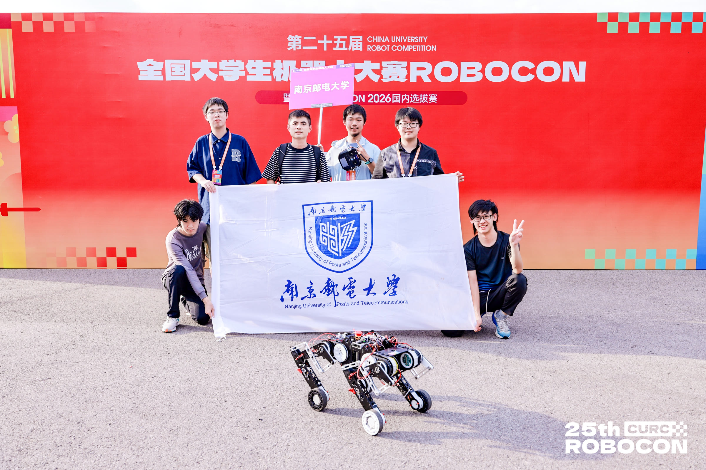

  

  <h1>NJUPT Initial</h1>

  
<strong>南京邮电大学机器人团队</strong>

  
以热爱为起点，用工程让想法落地。

# 关于我们

NJUPT Initial 是一支来自南京邮电大学的学生机器人团队。我们围绕机器人竞赛开展设计、研发与实践，在一次次调试和比赛中打磨可靠、灵活且富有创造力的机器人系统。

## 发展历史

- **2026 年** — 团队创建
- **2026.07** — 第二十五届全国大学生机器人大赛 ROBOCON 仿生足式机器人挑战赛：障碍赛国二，任务赛国三

## 技术方向

| 机械设计 | 电控与嵌入式 | 算法与感知 |
| :---: | :---: | :---: |
| 机构设计、建模仿真与加工装配 | 硬件设计、驱动控制与系统联调 | 环境感知、定位规划与智能决策 |

## 我们在做什么

- 面向赛事需求，完成机器人的设计、制造、开发与整机联调
- 沉淀可复用的软硬件模块和工程经验
- 在跨专业协作中探索机器人技术的更多可能

## 加入我们

我们欢迎对机器人、工程实践和团队协作感兴趣的南邮同学。无论你擅长机械、电子、软件，还是刚刚开始了解机器人，都可以通过本仓库的 [Issues](https://github.com/NJUPT-Initial/NJUPT-Initial/issues) 与我们交流。

  第二十五届全国大学生机器人大赛 ROBOCON · 南京邮电大学

